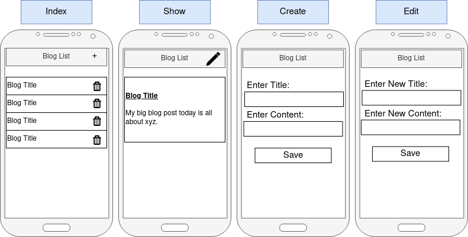
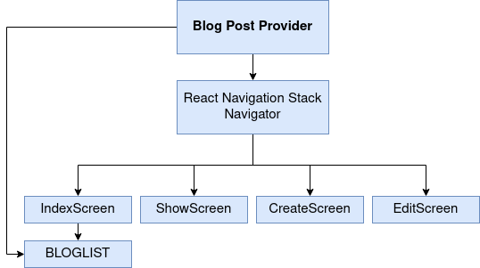
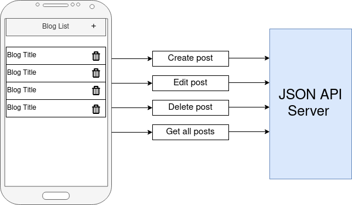
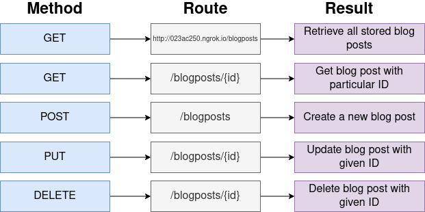
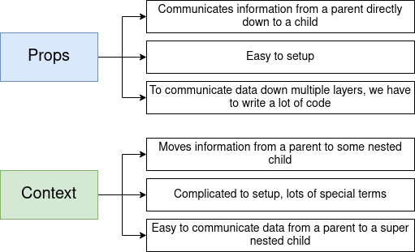
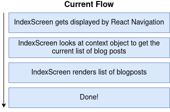
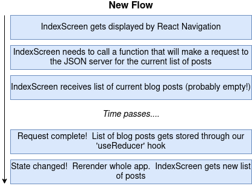

# Simple Blog - CRUD App

Blog Post with state storage & Context provider component - React Native CRUD App

[DEMO at Snack.expo.io](https://snack.expo.io/@webdevelop/post-state-storage)

[DEMO at Appetize.io](https://appetize.io/app/h3beptqp3eh0cmumn60q7ve5br?device=nexus5&scale=75&orientation=portrait&osVersion=8.1)

--------------------

Start the App and clear cache:
```
npm run start -c

npm run dev -c

yarn dev

```


[http://localhost:19002/](http://localhost:19002/)

--------------------

Fix errors:
``` 
rm -r node_modules

rm package-lock.json

expo upgrade

yarn dev
```

--------------------

#### project mockup




--------------------

#### project structure




--------------------

#### JSON Server connection




--------------------

#### HTTP requests




--------------------

#### props vs context



--------------------

#### project mockup




--------------------




--------------------

### create packages with expo


``` 
expo build:android -t apk
expo build:android -t app-bundle
```

``` 
expo build:ios -t archive
expo build:ios -t simulator
```

``` 
expo build:status

...

